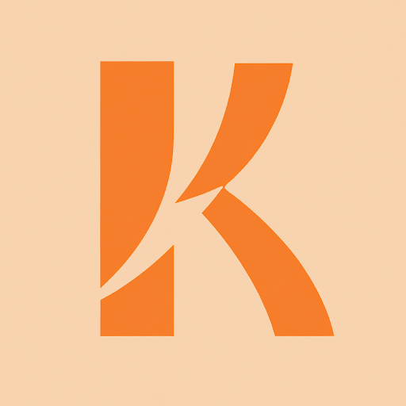

# Klear

Klear is a smart monitoring solution that helps daycare workers keep their children safe. Our computer vision software is installed into classroom security cameras and connects to a mobile app for staff to monitor. The software detects incidents and notifies users in real time while also storing it for review and training.

Table of Contents
---
- [Demo Video](./demo/demo.mp4)
- [Demo Writeup](./demo/demo_writeup.md)
- [Product Research](./product_research/)
- [Mobile App Repo](https://github.com/kerryzhu108/Klear-Frontend)
- [Backend Repo](https://github.com/kerryzhu108/Klear-Backend)
