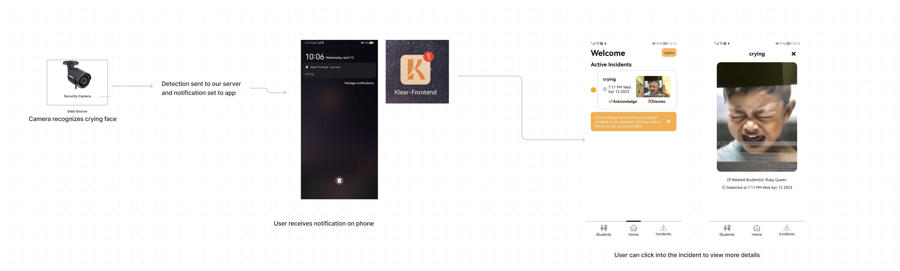
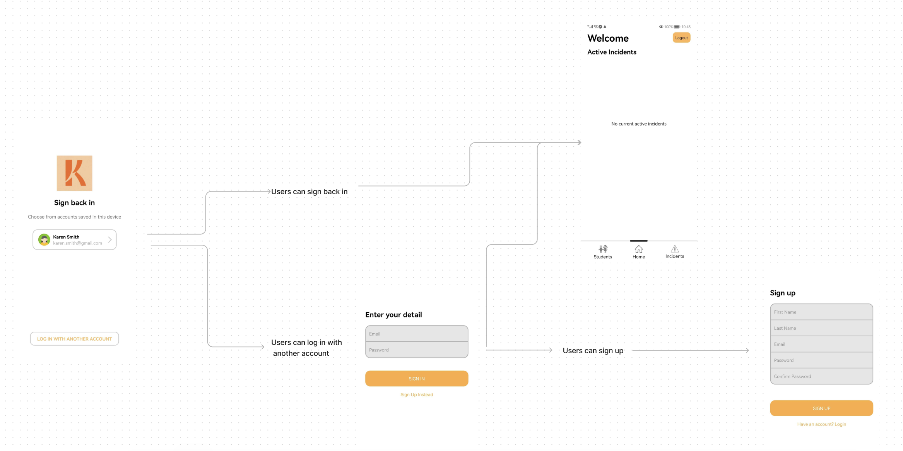
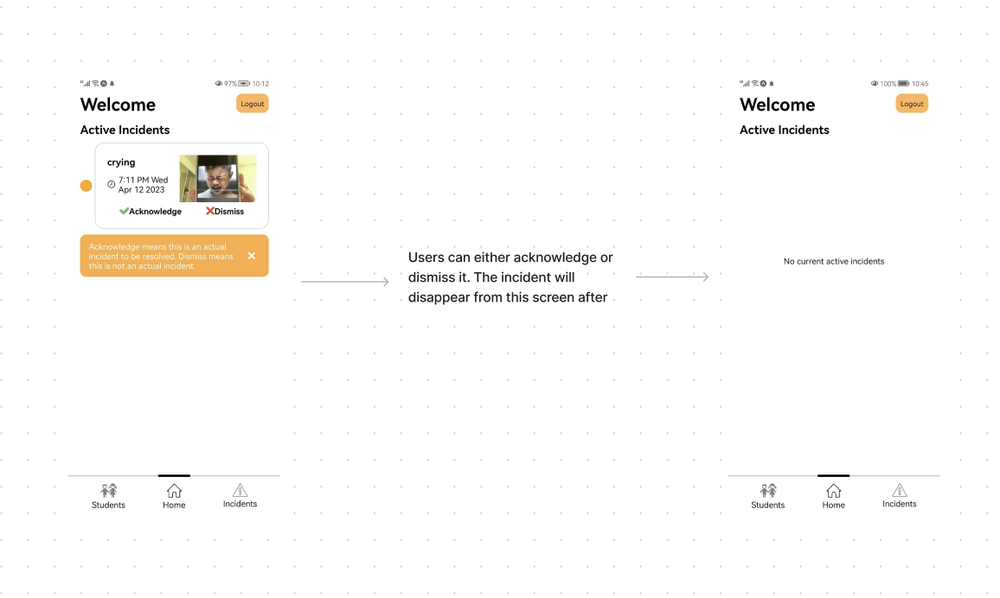
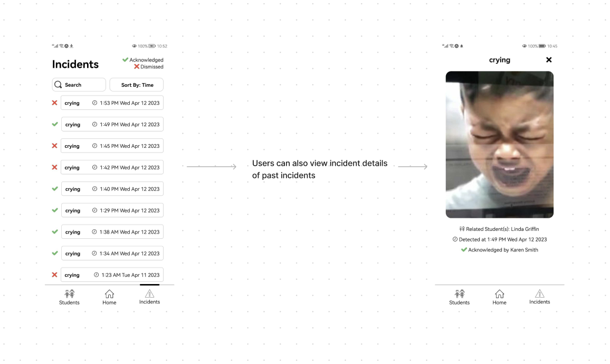
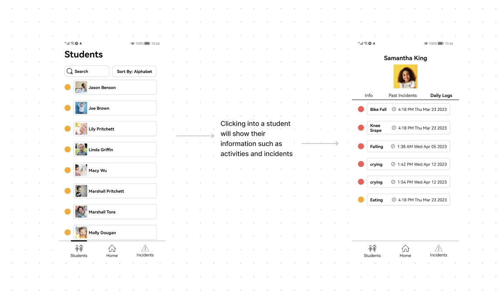

# Demo Write Up
Karen Smith is the persona we'll take on for this demo.
She is a staff working at a daycare, her classroom has a security camera that has our computer service software installed. It keeps watch over the children and if a child begins to cry it'll be able to detect it and send a notification to our mobile app, alerting Ms. Smith as well as providing details of the incident. 

Once she opens that notification on her phone, she'll be able to see the incident in the "Active Incident" page.

Starting with the login/register screen. This is where users can sign up or login, for the purpose of the demo a fake demo account with the name Karen Smith has been created. Clicking on that will log you into our app. 

To demo our security camera detection and notification service:
- a phone with the Klear app will act as the phone of a daycare staff
- the computer seen in the demo video will act as the camera (where the screen recording is from)
- to test the CV service and trigger incidents, follow the readme in "Klear-Backend" under "To run the CV/ML service"

The rest of the video goes through a quick functionality of the features we have developed: 

- The "Active Incident" screen is also called our homescreen, any new incidents here that were detected will be visible here. The user can then "acknowledge" or "dismiss" it based on the circumstances. Once they do that, the incident will disappear from the "Active Incidents" page and then go to the "Past Incidents" page. 

- The "Past Incidents" page holds all the incidents that have been acknowledged or dismissed. If the user opens one, they'll see all the relevent details about that incident such as the student attached and the time as well as who resolved it. 

- The "Students" page holds all the students in a classroom. In each invidividual student, their personal information, their activities, and their incidents can be seen. So any incident related to that student can easily be found here as well. From the student page, clicking on the incident will also bring up the details of the incident.

Area's not fully implemented
- The Student Info screen is very basic and lacks any design
- Sometimes there is a problem with the navigation when closing a screen