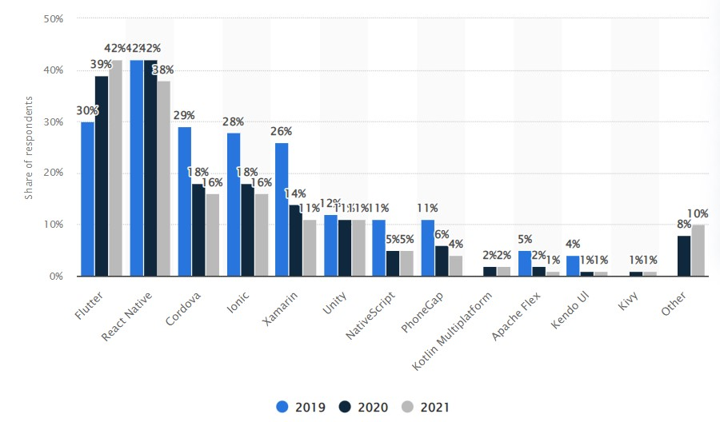

# Stack Decisions 

## Computer Vision
We will use OpenCV and Python for our Computer Vision and Machine Learning Service. 

| Python  | C++ |
| ------------- | ------------- |
| Python has been one of the **most used computing languages** in the field. Therefore, lots of resources are present for computer vision and machine learning applications. | Having to **manually allocate memory** using pointers can be time consuming and easy to lose track of. There is also no garbage collector feature to automatically filter out unnecessary data.
| Python offers **extensive libraries and toolboxes**. For example, MATLAB has statistical and machine learning toolboxes, which enable users to implement a range of algorithms at ease. The optimization toolbox can also help developers to implement more efficient algorithms. |  C++ the language **does not support built-in code threads**, which many other languages offer. Therefore, using C++ might make processes slower and more complicated.  |

**OpenCV**
- **Zero Cost**: OpenCV comes at free of cost even for commercial applications. Another advantage of choosing OpenCV is that it does require the users to make their applications open source.
Exhaustive Library: OpenCV has extensive algorithms for different computer vision algorithms. 
- **Platform and Devices**: OpenCV has a transparent API, making it compliant on devices. In addition, some applications and mobile apps prefer OpenCV as their vision library of choice for performance. 
Large Community: OpenCV is used by over 9 million people who are continually updating and helping each other through different platforms. One significant advantage of using OpenCV is that one could easily find support from the community.

## SNS
| Amazon SNS | OneSignal | Firebase | Leanplum |
| ------------- | ------------- | ------------- | ------------- |
| Supports internet connected smart devices such as mobile phones, kindle, iPad, etc | Supports Multiplatform notifications, Web Push, and Safari Push Notifications | Supports mobile notifications, and Web Push notifications | Supports mobile notifications, and Web Push notifications |
| Can send push notifications, SMS texts, emails, and/ or to HTTP endpoints | Supports push notifications, in app messaging, email, and SMS texts | Supports push notifications and in app messaging | Supports push notifications, in app messaging, email, and SMS texts |
| Can group multiple recipients using topics | Audience segmentation is only available for paid plans | Limited segmentation capabilities in the API | Supports user segmentation and message personalization |
| Has a free tier, but can be pricy as the volume of messages sent and the number of endpoints increase | The free tier has no limit on the number of mobile or in-app users and up to 10,000 web subscribers | Sending notifications can be free, but data storage, image hosting, and analytics have additional costs | Doesn’t have a free tier, and the pricing is not available to the public |
| | Provides comprehensive documentation and detailed instructions for initial setup. Relatively easy to get started | Blocked in China| |

Based on the comparison, we decided to go with OneSignal due to its ease of use and pricing. It offers comprehensive messaging channels, including email and SMS texts. Although the free plan doesn't include audience segmentation, we determined that this wasn't a crucial feature for our MVP. As a result, OneSignal's **ease of use**, extensive **messaging channels**, and **cost-effectiveness** make it the best choice for the MVP.

## Mobile App
We will be evaluating three mobile frontend frameworks: React Native, Ionic, and Flutter. The assessment criteria are documentation quality, community support, and our familiarity with the platform.

A look at the official documentation of each framework reveals that React Native and Flutter have more comprehensive and well-maintained docs compared to Ionic. Both websites have “Getting Started" sections with tutorials to help beginners set up their environment. React Native's documentation dives deeper into advanced topics such as networking and security, while Flutter provides more resources for transitioning from other frameworks. These differences likely stem from React's maturity and Flutter's emphasis on growth and having users switch over.

Having a large community for support is crucial in overcoming development challenges. According to a 2021 survey by [Statista](https://www.statista.com/statistics/869224/worldwide-software-developer-working-hours/), Flutter and RN have the largest two communities among the three frontend technologies followed by Ionic.

In terms of familiarity, one of our team members have done Frontend development using React and another has profession experience with React Native. We all have some experience working with HTML, CSS, and Javascript which Ionic uses while none of us has experience using Dart.

We opted to use React Native for the frontend because of its clear documentation, large community, and familiarity among us. Flutter was a strong second option but we decided against it because of the extra time needed to learn Dart. 

## Database 
For our database, we will compare a relational and non-relational option, namely MySQL and MongoDB. Our data consists of businesses like nurseries and daycares with each having administrators, staff, and cameras. Each staff member can subscribe to different cameras and view logs of saved video clips. 

The advantages of using a relational DB is that we always guarantee there is integrity between separate pieces of data like daycares and cameras. If we delete a business, MySQL ensures no data accociated to it with a foriegn key becomes orphaned. With a non-relational database, we have more flexibility to change our storage structure if we tweak our camera subscription ideas. We have equal experience working with MySQL and MongoDB so given the relational nature of the data we are storing, we opted to use MySQL. 

## Storage for Pictures

Note: We originally wanted to use AWS for video storage, but decided to against it and used ImageKit instead. 

For the MVP we want to store pictures, AWS was harder to set up on the frontend to display the pictures due to some iam issues we faced as well as policy issues. It's free tier also only offered 5GB of storage and only 20,000 requests which can easily be filled up from pictures fast while ImageKit offered 20GB of storage as well as no request limit. ImageKit offered more storage and less limits and so for the mvp we decided to opt for that instead.

### Old Rationale for using AWS 
Rationale can be found under stack decisions on learnsoftware. 

We debated between DigitalOcean and AWS S3. We chose AWS S3 due to privacy concerns for its ability to be more secure by easily pairing with other AWS services and for the fact it can process more requests which is something that might be important in the future. In addition, we are predicting that there may be large amount of storage transactions with more customers and perhaps incidents that we are detecting, in which case speed is important and aws may have an edge over DigitalOcean for speed in that case since we want to provide live notifications since aws has more regions and endpoints. 

| AWS S3  | DigitalOcean |
| ------------- | ------------- |
| More scalable, we currently don’t know how many images we may need to store so this is a safer option | DigitalOcean offers CDN with no additional cost, meaning content will be served to customer from the closest endpoint to them and so better load times
| Data security combined using other AWS services like AWS PrivateLink. Important for us since we’re storing pictures containing faces (privacy is important in this case)   |  But DigitalOcean is limited to 300 operations per second per space, which may or may not be enough for us in the future  |

