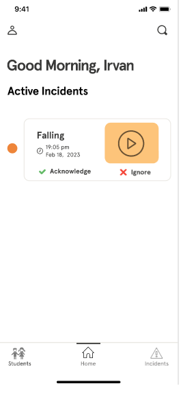
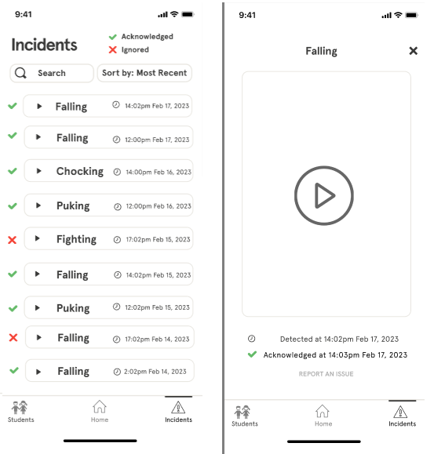
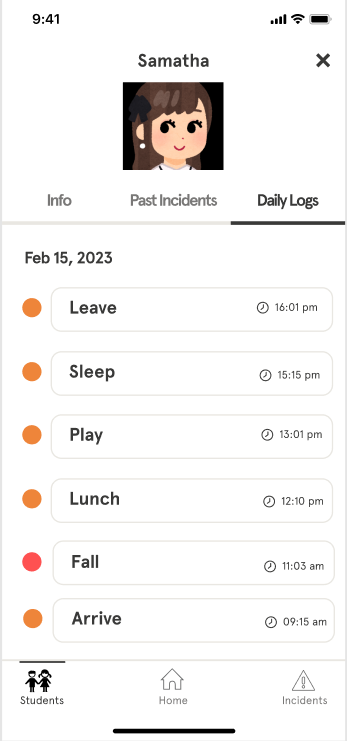

## Use Cases
1. The computer vision software part will be able detect children crying as our MVP

2. The computer vision software will be able summarize/label what it detected (in this case children crying), store a picture of the incident, and send out a notification with relevant information to the app.

3. User (staff) will be able to receive notifications on their phones. Opening their phones will reveal the alert title and a screenshot with the area that was detected to be dangerous.
    - For MVP, we’ll have one school as a customer to keep it simple
    - User will be able to ‘acknowledge’ it (if they received the notification, this will also stop the app from pinging the user)
    - User will be able to 'dismiss' it (if it’s something our software detected wrong)

4. Users will be able to see past events (logs) with timestamps and whether it was "ignored" or "acknowledged". Opening that certain log, they will be able to see a screenshot of the incident that occured

5. Users are able to see a list of children under their care and search for particular individuals. Each student has their own profile page with details on the activities they've engaged in and the incidents they've been involved in. Activity detection and facial recognition will be outside of the MVP. Activities under each student will be hard coded but incidents wont.

